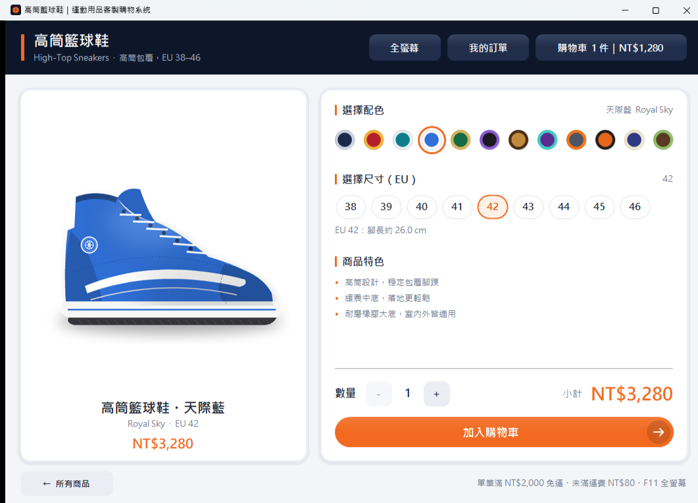
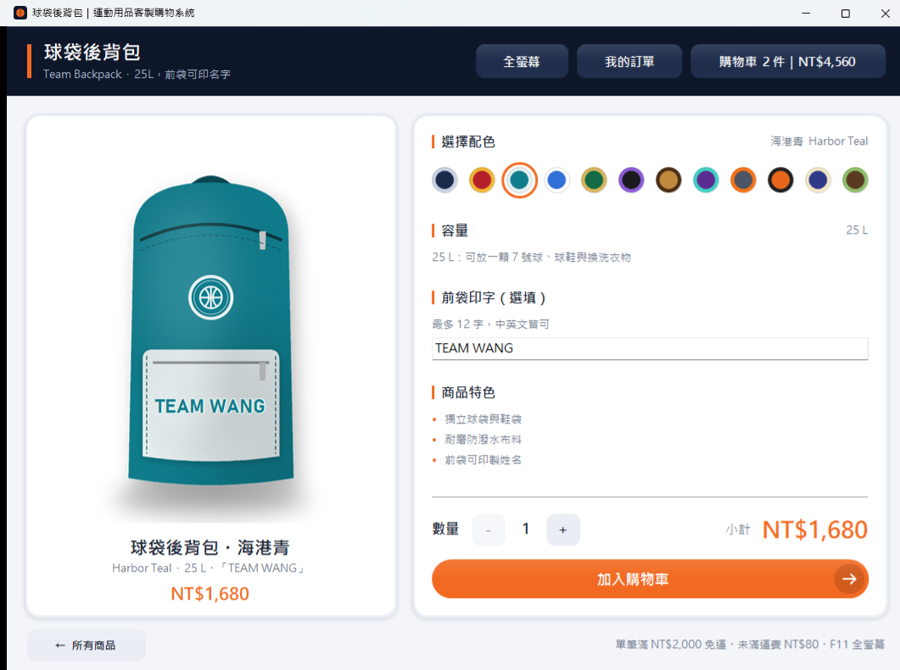
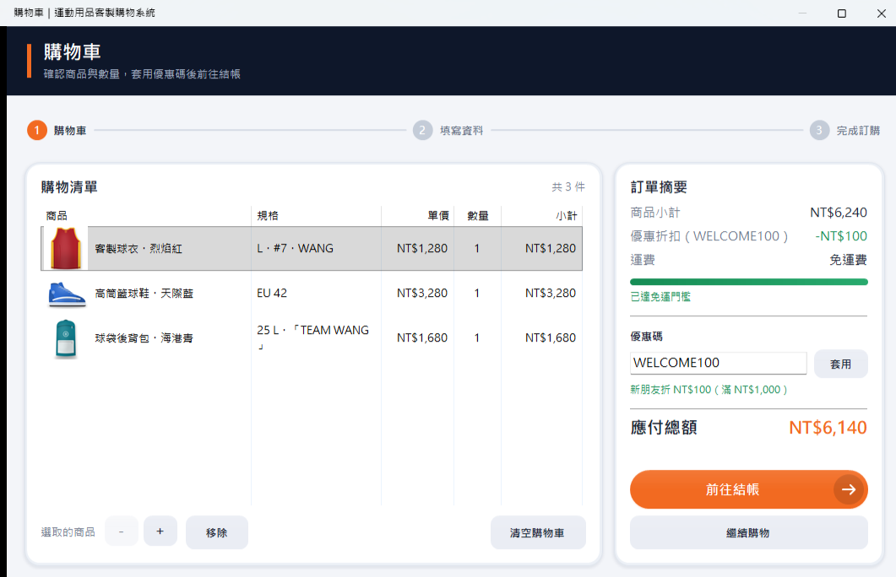
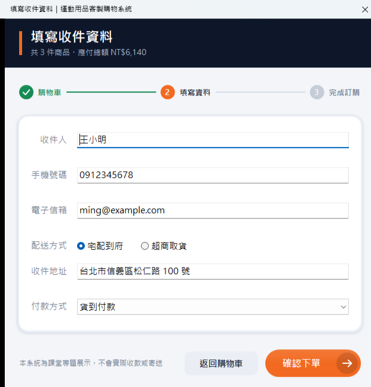
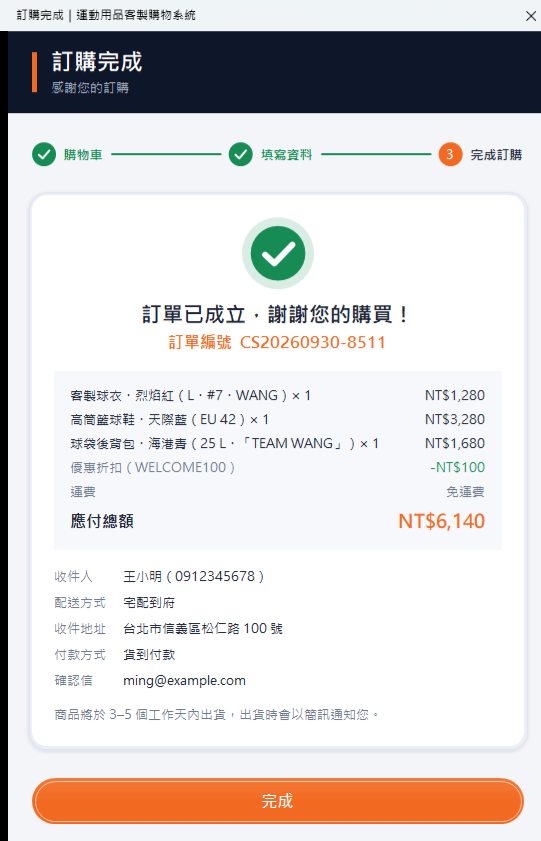
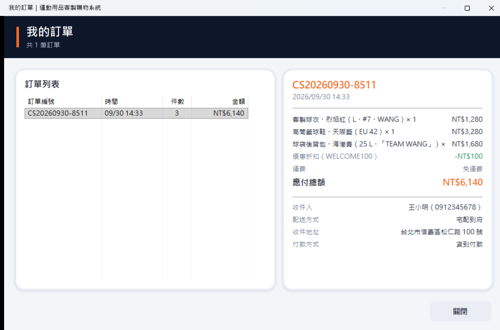

<p align="center">
  
</p>

<h1 align="center">運動用品客製購物系統<br><sub>Custom Sportswear Store</sub></h1>

<p align="center">
  C++17 × wxWidgets 桌面購物系統：8 類運動商品、12 款配色，<br>
  姓名與背號即時印在商品預覽上，從挑選、購物車到結帳一次完成。
</p>

<p align="center">
  <a href="../../releases/latest"><b>下載 Windows 版</b></a>
  ·
  <a href="#建置">自己編譯</a>
  ·
  <a href="docs/ARCHITECTURE.md">程式架構</a>
</p>

<p align="center">
  
</p>

## 功能

**逛商品**
- 8 類商品：客製球衣、籃球褲、高筒籃球鞋、棒球帽、配色籃球、籃球襪、護腕、後背包
- 依分類篩選：服裝／鞋款／球具／配件，也可以直接搜尋
- 愛心收藏，收藏的商品集中在「收藏」分類
- 12 款原創配色，色票點一下，預覽圖交叉淡入切換
- 尺寸以膠囊標籤選擇，下方即時顯示對應的尺寸說明（胸寬、衣長、腳長……）

**客製化與即時預覽**
- 球衣：背號＋姓名印在背面、隊名＋小背號印在正面，可切換正反面預覽，中英文都可以
- 團體訂購：一次輸入整隊的姓名、背號、尺寸，也能直接貼上 Excel 名單，重複背號會提醒
- 尺寸建議：衣服依身高體重、球鞋依腳長推薦尺寸，一鍵套用
- 籃球褲：褲管背號；籃球、後背包：印製文字；棒球帽、護腕：刺繡文字
- 預覽圖依視窗大小重新繪製，最大化或全螢幕時一樣清晰

**購物車與結帳**
- 加入購物車時，右上角購物車按鈕閃一下，並跳出通知；點通知直接開購物車
- 購物車附商品縮圖，可以增減數量、移除、清空；相同規格自動合併
- 訂單摘要：小計、優惠折扣、運費，以及「再買多少就免運」的進度條
- 優惠碼：`WELCOME100`（滿 NT$1,000 折 NT$100）、`TEAM10`（5 件以上 9 折）
- 三步驟結帳（購物車 → 填寫資料 → 完成），欄位離開時即時檢查，錯誤訊息顯示在欄位下方
- 宅配／超商取貨，付款方式跟著切換；完成後產生訂單編號與明細
- 「我的訂單」可以回頭查看每一筆訂單的內容與收件資訊；訂購完成頁可以把收據存成圖片

**介面**
- 自繪的按鈕、卡片、色票、尺寸標籤、進度條與步驟指示，滑鼠移上去有平滑過渡
- 換頁時視窗淡入淡出；`F11` 全螢幕、`Esc` 離開
- 支援 125%、150% 等高 DPI 縮放

## 畫面

| 全部商品（分類篩選） | 客製球衣（姓名、背號即時印上） |
| :---: | :---: |
|  |  |
| **高筒籃球鞋** | **後背包（前袋印字）** |
|  |  |
| **購物車（優惠碼、免運進度）** | **填寫資料** |
|  |  |
| **訂購完成** | **我的訂單** |
|  |  |

## 架構

```
WelcomeFrame ──► LauncherFrame（全部商品）──► ProductFrame（任一商品）
                                                  │  └─ Personalizer（客製化方式）
                                                  ▼
                               CartDialog ──► CheckoutDialog ──► OrderCompleteDialog
                               OrdersDialog（我的訂單）

資料   Catalog.cpp   商品、配色、優惠碼三張表 ＋ ShoppingCart ＋ OrderHistory ＋ Favorites
外觀   Theme / Widgets / SwatchPicker   配色與字型、自繪元件、動畫
```

- **資料驅動**：每一類商品都是 `Catalog.cpp` 裡的一筆資料（名稱、價格、尺寸、特色、印字位置）。
  畫面沒有寫死任何商品，新增一類商品只要加一筆資料和對應的圖。
- **Strategy 模式**：客製化方式（姓名＋背號／背號／文字／無）各自是一個 `Personalizer`
  子類別，負責自己的輸入欄位、購物車上的規格文字，以及畫在預覽圖上的樣子。
- **購物車單一實例**：`ShoppingCart::Get()` 讓每個畫面看到的是同一台購物車。

詳細說明見 [`docs/ARCHITECTURE.md`](docs/ARCHITECTURE.md)。

## 建置

需求：Windows 10/11、Visual Studio 2026（「使用 C++ 的桌面開發」，工具組 v145）、wxWidgets 3.3。
用 Visual Studio 2022 開啟時，在專案上按右鍵選「重新設定專案目標」改成 v143 即可。

1. 編譯 wxWidgets：開 `wxWidgets\build\msw\wx_vc17.sln`，分別建置 x64 的 Debug 和 Release。
2. 開 `CustomSportswearStore.sln`。若 wxWidgets 不在 `C:\wxWidgets-3.3.3`，
   到專案屬性修改「C/C++ → 其他 Include 目錄」、「連結器 → 其他程式庫目錄」和「資源 → 其他 Include 目錄」。
3. 選 `x64`，按 F5 執行。

打包成可以直接給別人的 zip（exe、素材、C++ 執行階段 DLL）：

```powershell
powershell -ExecutionPolicy Bypass -File tools\package.ps1 -Version v2.0.0
```

## 素材

所有圖片（商品、標誌、主視覺）都是 [`tools/gen_assets.py`](tools/gen_assets.py) 用程式畫出來的原創圖，
沒有使用照片、網路圖片或任何品牌商標。調整配色或造型後重新產生：

```bash
pip install pillow
python tools/gen_assets.py
```

<details>
<summary>English</summary>

A C++17 / wxWidgets desktop store for custom basketball gear: 8 product types in 12 original
colourways, with names and numbers rendered live onto the product preview. It has a cart with
thumbnails, coupons and a free-shipping progress bar, a three-step checkout with inline validation,
custom-drawn animated controls, full-screen support and high-DPI rendering. Products are rows in a
data table (`Catalog.cpp`); customisation uses the Strategy pattern (`Personalizer`). All artwork is
generated by `tools/gen_assets.py` — no photos or third-party marks.

</details>
