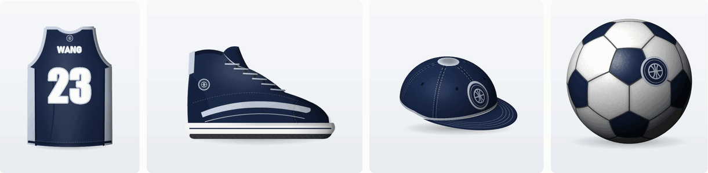
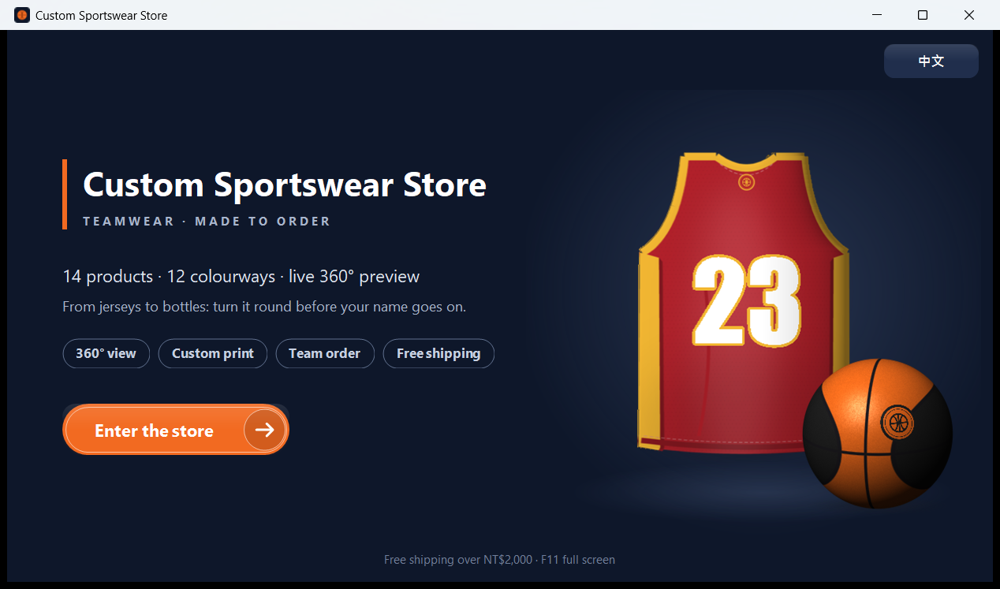
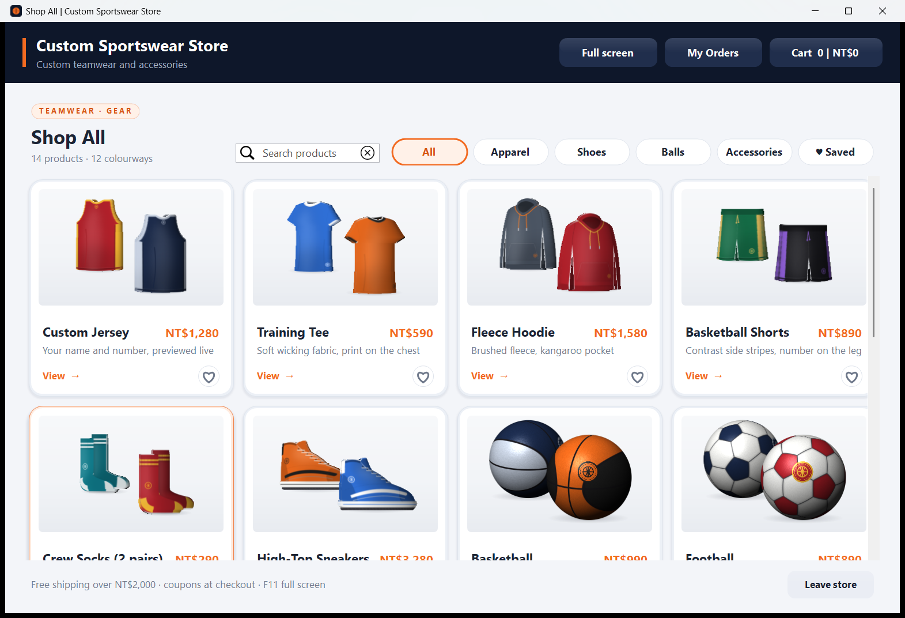
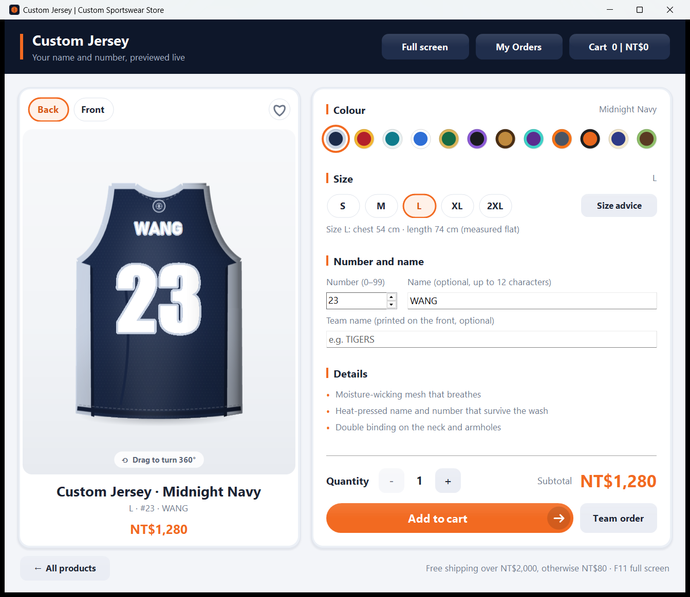
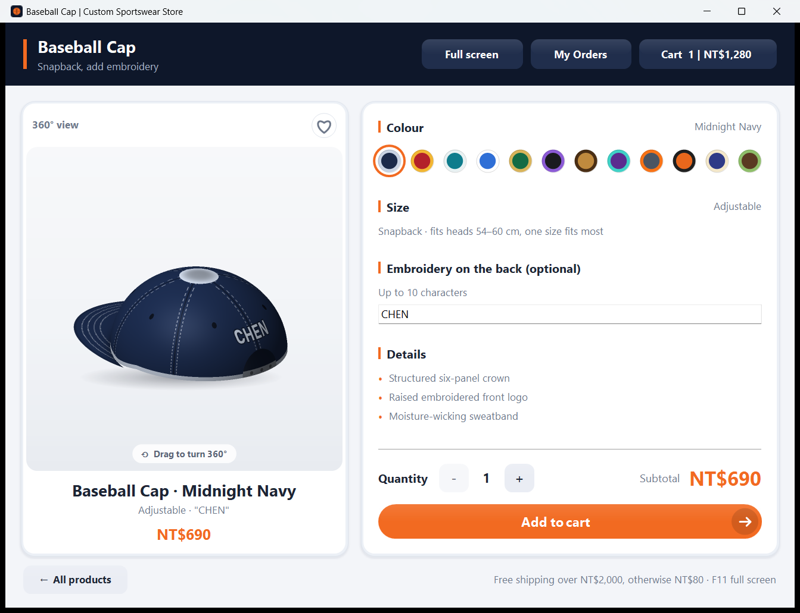
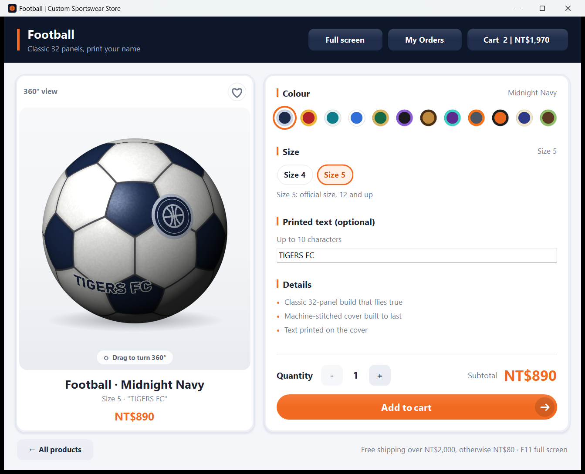
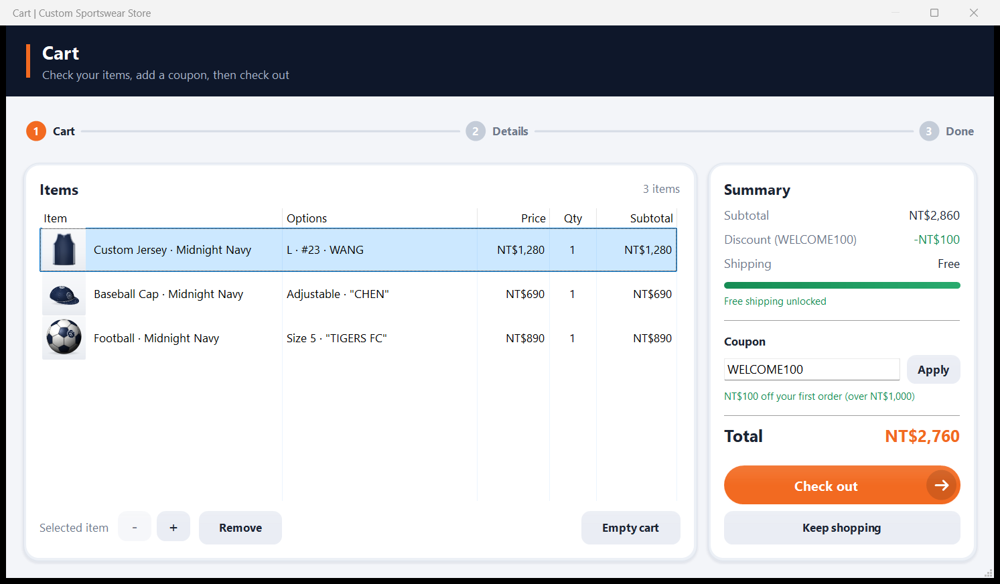
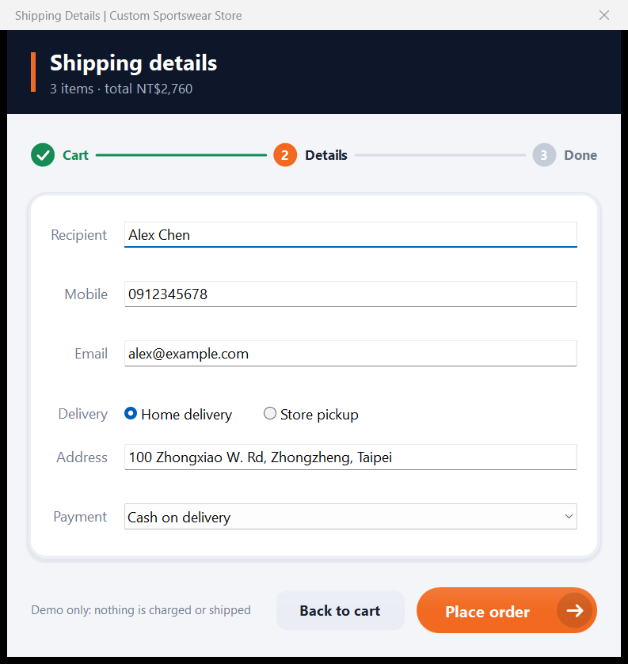
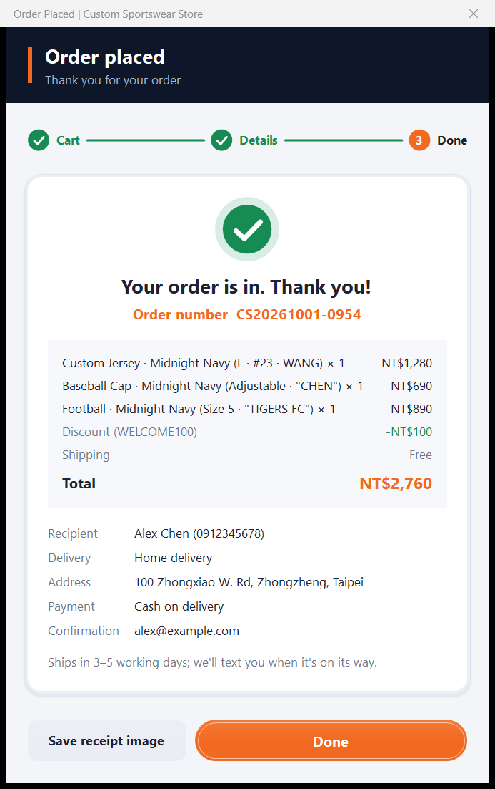
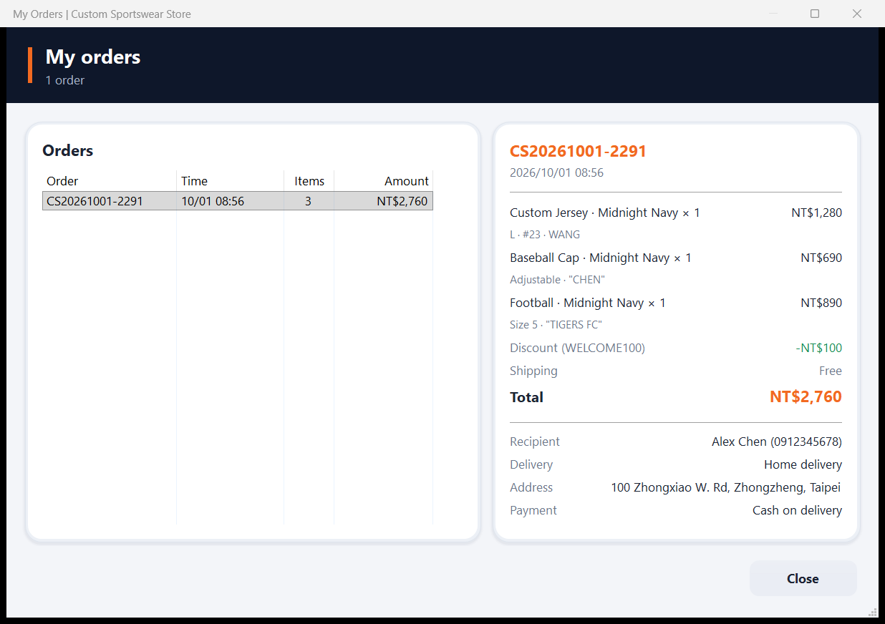

<p align="center">
  
</p>

<h1 align="center">Custom Sportswear Store</h1>

<p align="center">
  A Windows desktop store for custom teamwear, written in C++17 with wxWidgets.<br>
  14 products, 12 colourways, and a 360° view you can drag to see your name and number on the product.
</p>

<p align="center">
  <a href="../../releases/latest"><b>Download for Windows</b></a>
  ·
  <a href="#building">Build it yourself</a>
  ·
  <a href="docs/ARCHITECTURE.md">How it works</a>
</p>

<p align="center">
  
</p>

## What's in it

**Browse**
- 14 products in four groups: jerseys, tees, hoodies, shorts and socks; high-top sneakers;
  a basketball and a football; caps, headbands, wristbands, a backpack, a squeeze bottle and a towel
- Filter by group, search by name, and keep favourites under ♥
- 12 original colourways; every product card shows two of them, drawn live

**See it before you buy it**
- Drag any product to turn it all the way round. It keeps a little momentum when you let go
  and turns back to the front on a double-click.
- Type a name, number or team and the product turns to where it will be printed: the back
  of a jersey, the chest of a hoodie, the back strap of a cap, round the side of a bottle
- Balls and the cap are drawn in real 3D (sphere and ellipsoid shading, seams, pebble grain);
  clothes, shoes and bags wrap their front and back artwork round a rounded body
- Team orders: enter a whole roster (or paste it from a spreadsheet), duplicate numbers are flagged
- Size advice from height and weight, or foot length for shoes

**Cart and checkout**
- Cart with product thumbnails, quantities, and a free-shipping progress bar
- Coupons: `WELCOME100` (NT$100 off orders over NT$1,000) and `TEAM10` (10% off five items or more)
- Three-step checkout with inline validation, home delivery or convenience-store pickup
- Order confirmation you can save as an image, and an order history

**English and Chinese**
- The whole interface comes in both languages. It opens in your Windows language and
  remembers the one you pick with the switch on the welcome screen.

**Feel**
- Custom-drawn buttons, chips, swatches, cards and progress bars, with smooth transitions
- Staggered fade-in on the product list, crossfades between colourways, a welcome screen with a
  jersey and ball turning under a spotlight
- `F11` for full screen; per-monitor high-DPI aware, so text and artwork stay sharp at 125–200%

## Screenshots

| Welcome | Product list |
| :---: | :---: |
|  |  |
| **Jersey with name and number** | **Cap, drawn in 3D** |
|  |  |
| **Football** | **Cart** |
|  |  |
| **Checkout** | **Order confirmation** |
|  |  |
| **Order history** | |
|  | |

## How it's put together

```
WelcomeFrame ──► LauncherFrame (product list) ──► ProductFrame (any product)
                                                     ├─ Turntable     drag-to-turn 360° view
                                                     └─ Personalizer  name / number / text inputs
                                                     ▼
                         CartDialog ──► CheckoutDialog ──► OrderCompleteDialog
                         OrdersDialog (order history)

Data     Catalog       products, colourways and coupons as tables; cart, orders, favourites
3D       Showcase      one model per product shape: wrapped artwork, sphere, cap, cylinder
Look     Theme / Widgets / SwatchPicker   palette, fonts, custom-drawn controls, animation
Text     Lang          every label in Chinese and English
```

- **Data-driven catalogue.** Every product is one row in `Catalog.cpp`: name, price, sizes,
  print areas and how its 3D view turns it. No screen hard-codes a product.
- **Strategy pattern.** Each way of customising a product (name + number, number, text, none)
  is a `Personalizer` subclass that owns its inputs, its line in the cart and its print.
- **No 3D engine.** `Showcase` works out every pixel itself: turn the pixel back into the
  product's own coordinates, find which panel, seam or print it lands on, then light it.

More detail in [`docs/ARCHITECTURE.md`](docs/ARCHITECTURE.md).

## Building

You need Windows 10 or 11, Visual Studio 2026 with *Desktop development with C++* (toolset v145),
and wxWidgets 3.3. Visual Studio 2022 works too: right-click the project and retarget it to v143.

1. Build wxWidgets: open `build\msw\wx_vc17.sln` in the wxWidgets folder and build x64 Debug and Release.
2. Tell the project where wxWidgets is, either with a `WXWIN` environment variable or a file
   `CustomSportswearStore\wx.local.props` (it is git-ignored):
   ```xml
   <Project xmlns="http://schemas.microsoft.com/developer/msbuild/2003">
     <PropertyGroup><WXWIN>C:\path\to\wxWidgets-3.3.3</WXWIN></PropertyGroup>
   </Project>
   ```
3. Open `CustomSportswearStore.sln`, pick `x64`, press F5.

To make a zip you can hand to someone (exe, artwork and the C++ runtime):

```powershell
powershell -ExecutionPolicy Bypass -File tools\package.ps1 -Version v2.2.0
```

## Artwork

Every picture is drawn by [`tools/gen_assets.py`](tools/gen_assets.py): the products, the
colourways and the basketball mark are all original. There are no photos, downloaded images or
third-party logos. To redraw after changing a colour or a shape:

```bash
pip install pillow
python tools/gen_assets.py
```

<details>
<summary>中文說明</summary>

**運動用品客製購物系統**：以 C++17 與 wxWidgets 寫成的 Windows 桌面購物系統，主題是運動用品客製化。

- 14 項商品、12 款原創配色，分類篩選、搜尋、收藏
- 360° 預覽：拖曳商品可以轉一整圈；輸入姓名、背號或文字時，商品會自動轉到印製的位置
- 籃球、足球與棒球帽以即時 3D 繪製；衣服、鞋子、背包把正反面圖包覆在圓弧身體上轉動
- 團體訂購、尺寸建議、購物車與優惠碼、三步驟結帳、訂單紀錄
- 自繪元件與動畫、全螢幕、高 DPI 清晰顯示

所有圖片都由 `tools/gen_assets.py` 以程式繪製，沒有使用照片或任何品牌商標。

</details>
